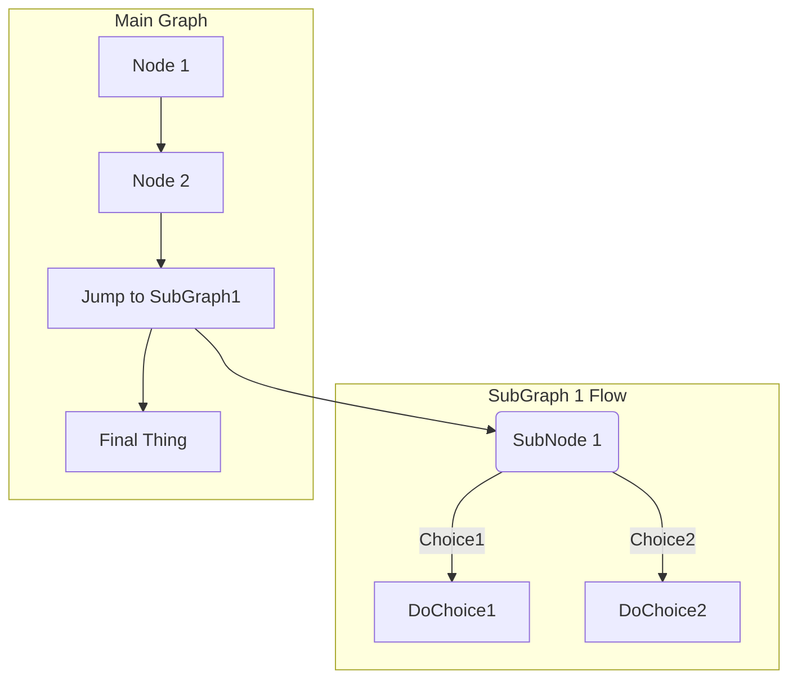

# 한글이 되는지 확인합니다.
## 다음 레벨이 구분되어 보일까요

* 수식이 되는지도 궁금합니다.
## RA policy
### skeleton code

The following code is to calculate the parameter of the exponential model, lambda in case of RA according to Equation (C-1) on the page 114 in RP-1. 

This math is inline $`a^2+b^2=c^2`$.

This is on a separate line

```math
a^2+b^2=c^2
```

